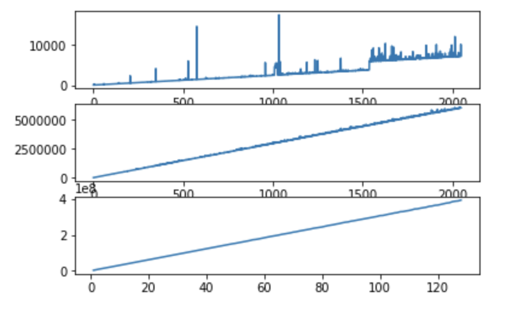
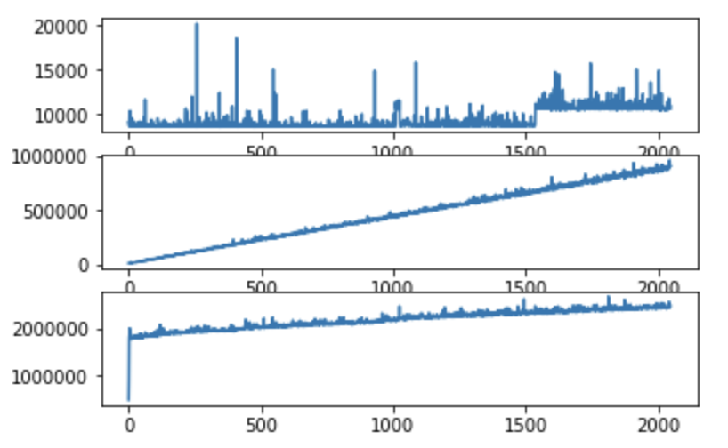
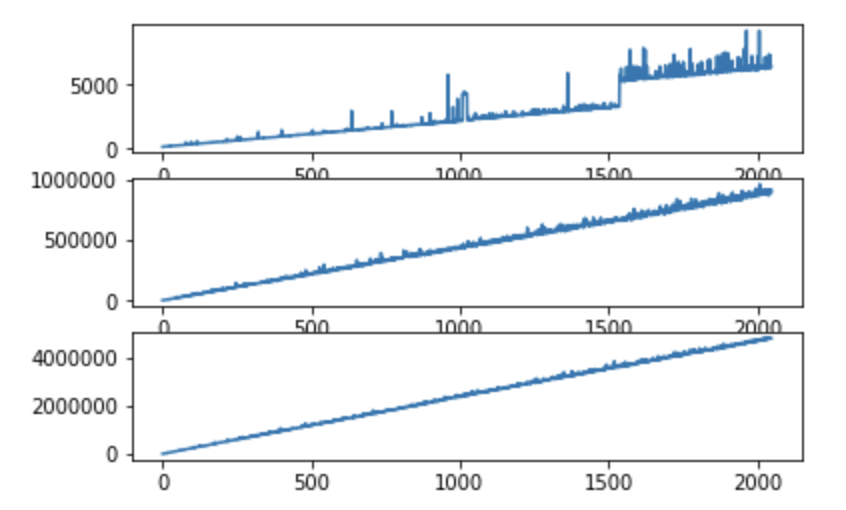
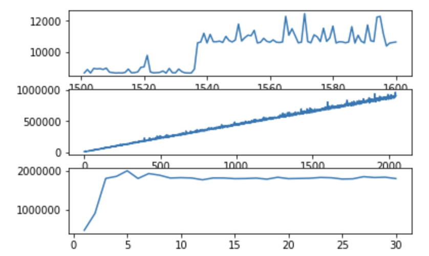
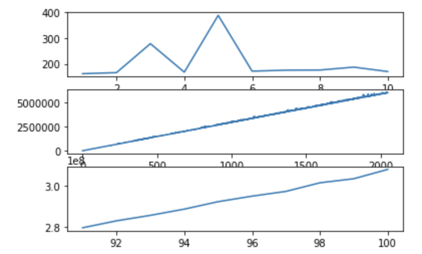

# Project2

> Author : 胡子昂 <br>
>
> 本次作业完成对本机cache的计算。

## 机器的详细配置

- 查看电脑配置如下：

```
硬件概览：

  型号名称：	MacBook Pro
  型号标识符：	MacBookPro14,1
  处理器名称：	Intel Core i5
  处理器速度：	2.3 GHz
  处理器数目：	1
  核总数：	2
  L2 缓存（每个核）：	256 KB
  L3 缓存：	4 MB
  内存：	8 GB
  Boot ROM 版本：	MBP141.0175.B00
  SMC 版本（系统）：	2.43f6
  序列号（系统）：	FVFW41A3HV2D
  硬件 UUID：	2A67EB9E-7112-52A5-8062-1DBA84638C27
```

## 程序介绍

- 程序分为c语言程序，sh脚本，和py脚本。

1. c语言程序：

   通过new char数组，声明空间，并且访问空间中的元素（读）。程序中，n代表数量，l代表单位（B，KB，MB），计时方法使用chrono库（精确到ns级）。有三种方法：

   - 读全部元素
   - 读1024个元素，间隔为n * l /1024
   - 读n个元素，间隔为l

2. sh脚本：

   通过for循环不停的运行c语言程序，得到结果，并将结果输入到csv中。（data文件夹内）

   （PS：测试结果是10次取平均）

3. py脚本：

   分析数据并画图。

## 结果如图所示

- PS：从上到下是B，KB，MB的读时间。

- 方法一：读全部元素

  

- 方法二：读1024个元素，间隔为n * l /1024

  

- 方法三：读n个元素，间隔为l

  

## 结果分析

1. 可以很明显的看出，方法二中，出现了两个断层。细节如下：



- 推测：

  在最上面图中，出现了明显的梯度上升，推测是一个L1的cache不足的原因。L1的cache大小为1535B左右，即1.5KB。

  在最下面图中，3MB左右出现了时间增长的暂停，推测在3MB后，由于1024个数据每个数据读的时候都需要重新覆写cache，因此时间不在增长。算出cache大小为3MB/1024 = 3KB。根据cache大小，推测为L1的cache，即两个核各有1.5MB大小的L1cache。


2. 将方法一的图放大，如下：



- 推测：

  整个图呈现一个线性的增长。

  在最下面的图中，可以计算出存储器带宽为：$\frac{98 * 10^6}{3 * 10^8 * 10^{-9}} ≈ 3.27 * 10^8 B/s$

  在最上面的图中，可以看出存储器的时延大约为170ns。

## 结论

1. 机器核有三层缓存，L1为3KB，L2为512KB，L3为4MB。每个核有单独的L1和L2缓存。
2. 存储器带宽为3.27*10^8 B/s。
3. 存储器的访问时延为170ns。

局部数据在3KB内的程序（并行程序为1.5KB），在我的机器上更能发挥核的性能。